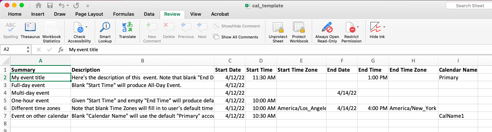
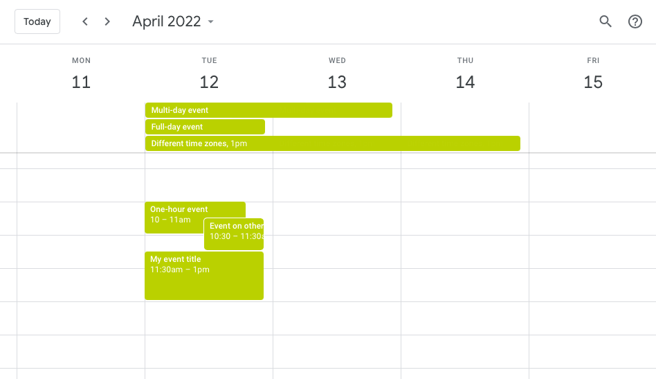

# excel_to_calendar
This is a Python script that allows a large number of Google Calendar events to be easily created with an Excel spreadsheet.

For example, I enter the information for six events in the Excel file.

The program then creates these six events in my Google Calendar.

## Usage
- Actually using this will involve first getting a Google Developer token (or emailing me for the one I have for this)
- Save the token and Excel file 'cal_template.xlsx' in the same directory as 'excel_to_calendar.py'
- (Optional) In the 'fill-in values' tab of the Excel file, set up the desired "Time Zone Shortlist" and "Calendar Names".  Note: if you leave the time zones and calendar names blank, the program uses the default values from your Google account.
- Enter event information into 'cal_template.xlsx' and save the file
- Compile 'excel_to_calendar.py' in an interactive Python environment (eg Spyder), and then run the command `xlsx_to_calendar('cal_template.xlsx', 'template')`. The first argument is the file name, and the second (optional) argument is the tab name. The first time running the program requires logging into the relevant Google account.
- Be grateful that you didn't have to manually enter 30 different events that were *almost* the same, but too different to make a Recurring Event!

## Note
This was only intended for my personal use, so I made no attempt to "safeguard" the program against user error.
